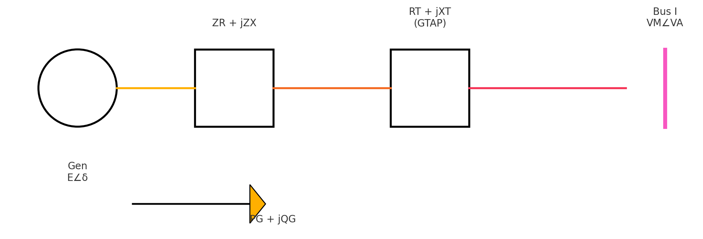

# 📘 PSS®E `.raw` File Format (Version 33) – Summary

The `.raw` file is a plain-text input format used by Siemens PSS®E for steady-state power system modeling. Version 33 supports a structured sequence of data sections, all representing a **positive-sequence balanced system**.

---

## 📌 Header Line

```
I, BASEMVA, REV, XFRRAT, NXFRAT, FREQ
```

| Field      | Description                            |
|------------|----------------------------------------|
| `I`        | Indicator: 0 = full data export        |
| `BASEMVA`  | System base MVA                        |
| `REV`      | RAW file version (33 in this case)     |
| `XFRRAT`   | Reserved                               |
| `NXFRAT`   | Reserved                               |
| `FREQ`     | System frequency (usually 60.00)       |

---

## 🔹 1. **Bus Data Section**

```
I, NAME, BASKV, IDE, AREA, ZONE, OWNER, VM, VA, NVHI, NVLO, EVHI, EVLO
```

| Field   | Meaning |
|---------|---------|
| `I`     | Bus number (integer) |
| `NAME`  | Bus name (up to 12 characters) |
| `BASKV` | Base voltage in kilovolts (kV) |
| `IDE`   | Bus type: 1 = Load, 2 = Gen, 3 = Slack, 4 = Isolated |
| `AREA`  | Control area number |
| `ZONE`  | Zone number |
| `OWNER` | Owner number |
| `VM`    | Voltage magnitude (in per unit, p.u.) |
| `VA`    | Voltage angle (in degrees) |
| `NVHI`  | **Normal high voltage limit** (p.u.) – acceptable steady-state upper bound |
| `NVLO`  | **Normal low voltage limit** (p.u.) – acceptable steady-state lower bound |
| `EVHI`  | **Emergency high voltage limit** (p.u.) – upper bound during contingencies |
| `EVLO`  | **Emergency low voltage limit** (p.u.) – lower bound during contingencies |

> All voltage values (`VM`, `NVHI`, `NVLO`, `EVHI`, `EVLO`) are in **per unit (p.u.)**, and all angles (`VA`) are in **degrees**.
---

## 🔹 2. **Generator Data Section**

```
I, ID, PG, QG, QT, QB, VS, IREG, MBASE, ZR, ZX, RT, XT, GTAP, STAT, RMPCT, PT, PB, O1–O8
```

| Field     | Description |
|-----------|-------------|
| `I`       | Bus number where the generator is connected |
| `ID`      | Generator ID (2 characters, e.g. '1 ') |
| `PG`      | Active power output (MW, total for 3 phases) |
| `QG`      | Reactive power output (MVAr, total for 3 phases) |
| `QT`      | Maximum reactive power limit (MVAr) |
| `QB`      | Minimum reactive power limit (MVAr) |
| `VS`      | Voltage setpoint (p.u.) at regulated bus |
| `IREG`    | Bus number where voltage is regulated |
| `MBASE`   | Generator MVA base |
| `ZR`, `ZX`| Step-up transformer resistance/reactance (p.u.) |
| `RT`, `XT`| Transformer impedance (p.u.) |
| `GTAP`    | Transformer tap ratio |
| `STAT`    | Generator status (1 = in service, 0 = out of service) |
| `RMPCT`   | Participation factor in automatic generation control (AGC) |
| `PT`      | Maximum active power limit (MW) |
| `PB`      | Minimum active power limit (MW) |
| `O1`–`O8` | Ownership identifiers or participation fractions |

> Note: All power values (`PG`, `QG`, `QT`, `QB`, `PT`, `PB`) are in **megawatts (MW)** or **megavars (MVAr)** and represent **3-phase totals**. Impedances are in **per unit (p.u.)** on the specified `MBASE`.

---

## 🔹 3. **Fixed Shunt Data Section**

```
I, ID, STATUS, GL, BL
```

| Field  | Description                                                |
|--------|------------------------------------------------------------|
| `I`    | Bus number where the shunt is connected                    |
| `ID`   | Shunt identifier (2 characters)                            |
| `STATUS` | 1 = in service, 0 = out of service                       |
| `GL`   | Conductance in MW on the system base                       |
| `BL`   | Susceptance in MVAr on the system base                     |

> `GL` and `BL` represent the real and reactive power at a bus voltage of 1.0 p.u. They can be converted to siemens using `V^2` where `V` is the bus base kV.

---

## 🔹 5. **Transformer Data Section**

Each transformer record spans **3 or 4 lines** depending on the winding configuration.

---

### 🔸 Line 1: Transformer Buses and ID

```
I, J, K, CKT, CW, CZ, CM, MAG1, MAG2, NMETR, NAME
```

| Field | Description |
|-------|-------------|
| `I`, `J`, `K` | Bus numbers for windings 1, 2, 3 (K=0 for 2-winding) |
| `CKT` | Circuit ID (up to 2 characters) |
| `CW` | Winding data format code (1, 2, or 3) |
| `CZ` | Impedance data code |
| `CM` | Magnetizing admittance code |
| `MAG1`, `MAG2` | Magnetizing admittance (in % or p.u.) |
| `NMETR` | Metering winding (1, 2, or 3) |
| `NAME` | Transformer name (up to 12 characters) |

---

### 🔸 Line 2: Winding 1 Data

```
WINDV1, NOMV1, ANG1, R1-2, X1-2, SBASE1-2
```

| Field | Description |
|-------|-------------|
| `WINDV1` | Voltage magnitude setpoint for winding 1 (p.u.) |
| `NOMV1` | Nominal kV for winding 1 |
| `ANG1` | Phase shift angle for winding 1 (degrees) |
| `R1-2`, `X1-2` | Resistance and reactance between winding 1 and 2 (p.u.) |
| `SBASE1-2` | MVA base for impedance (1-2) |

---

### 🔸 Line 3: Winding 2 Data

```
WINDV2, NOMV2, ANG2, R2-3, X2-3, SBASE2-3
```

| Field | Description |
|-------|-------------|
| `WINDV2` | Voltage magnitude setpoint for winding 2 (p.u.) |
| `NOMV2` | Nominal kV for winding 2 |
| `ANG2` | Phase shift angle for winding 2 (degrees) |
| `R2-3`, `X2-3` | Resistance and reactance between winding 2 and 3 |
| `SBASE2-3` | MVA base for impedance (2-3) (set to 0 if 2-winding) |

---

### 🔸 Line 4: Winding 3 Data (Optional)

```
WINDV3, NOMV3, ANG3, R3-1, X3-1, SBASE3-1
```

| Field | Description |
|-------|-------------|
| `WINDV3` | Voltage magnitude setpoint for winding 3 (p.u.) |
| `NOMV3` | Nominal kV for winding 3 |
| `ANG3` | Phase shift angle for winding 3 (degrees) |
| `R3-1`, `X3-1` | Resistance and reactance between winding 3 and 1 |
| `SBASE3-1` | MVA base for impedance (3-1) |

---

## 🔹 🔍 Transformer Record Example – Breakdown

```
8,    5,    0,'1 ',1,1,1,  0.00000,  0.00000,2,'        ',1,   1,1.0000,   0,1.0000,   0,1.0000,   0,1.0000
0.00000, 0.02670, 100.00
0.98500,  0.000,   0.000,   0.00,   0.00,   0.00,0,     0, 1.50000, 0.51000, 1.50000, 0.51000,159, 0, 0.00000, 0.00000
1.00000,  0.000
```

| Line | Description |
|------|-------------|
| Line 2 | Impedance R₁₂ = 0.00000 p.u., X₁₂ = 0.02670 p.u. on 100 MVA base |
| Line 3 | Winding 1 setpoint = 0.985 p.u., no regulation, thermal limits = 1.5 MVA |
| Line 4 | Winding 2 setpoint = 1.000 p.u., no phase shift |

